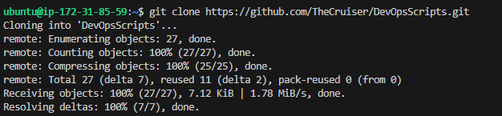
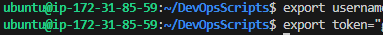

# aws_resource_track.sh
----------------------------------------------------------------------------------------

To Track resources using AWS with Shell Script

A small script where using AWS, we'll be sharing resource usage of AWS Components like EC2, S3, Lambda, IAM etc. at a particular time to the reporting dashboard. Using a Cronjob.
#1: Create the EC2 instance with AWS and run in MobaxTerm (any OS) {if we need to use Linux in Windows - WSL can help as well.} and more.

**NOTE:** change your 'export AWS_DEFAULT_REGION' to your specific one.

----------------------------------------------------

# GithubAPIAWS_listUsers.sh
-----------------------------------------------------------------------------------------

### Step 1: Create an EC2 instance with AWS Console. Use the public IPv4 address from there. Login using 


### Step 2: Now clone the repo to get the script.


### Step 3: Now export the username and the token, so that you're logged in to the EC2 instance:


### Step 4: Now select the organization's name you are part of (in GitHub)

< it might require to install jq library - sudo apt install jq / pip install jq >

put up in this format < ./script orgname reponame >


### Voila !!! All collaborators having read access to this repo and org will show up.  :star_struck: 


------------------------------------------------------------------------------------------


# ansible_manage
---------------------------------------------------------------------------------------------

### Create 2 EC2 instances (in production scenario, one device will have the ansible script (let's consider it as A) and the other one on which it will be applied (let's consider it as B))

### Log into A first and try to SSH to B

```
ubuntu@ip-172-31-85-59:~$ ssh 172.31.83.213
The authenticity of host '172.31.83.213 (172.31.83.213)' can't be established.
...
ubuntu@172.31.83.213: Permission denied (publickey).
```

### Create SSH keygen in both A & B

```
ubuntu@ip-172-31-85-59:~$ ssh-keygen
Generating public/private rsa key pair.
Enter file in which to save the key (/home/ubuntu/.ssh/id_rsa):
Enter passphrase (empty for no passphrase):
Enter same passphrase again:
Your identification has been saved in /home/ubuntu/.ssh/id_rsa
Your public key has been saved in /home/ubuntu/.ssh/id_rsa.pub
```
```
ubuntu@ip-172-31-22-194:~$ ssh-keygen
Generating public/private ed25519 key pair.
Enter file in which to save the key (/home/ubuntu/.ssh/id_ed25519):
Enter passphrase (empty for no passphrase):
Enter same passphrase again:
Your identification has been saved in /home/ubuntu/.ssh/id_ed25519
Your public key has been saved in /home/ubuntu/.ssh/id_ed25519.pub
```

### Save the data of public key of A in 'authorized_keys' of B.

```
ubuntu@ip-172-31-85-59:~$ cat /home/ubuntu/.ssh/id_rsa.pub
```
```
ubuntu@ip-172-31-22-194:~$ vim ~/.ssh/authorized_keys
```

### Now SSH from A to B. You'll be able to log in.
```
ubuntu@ip-172-31-85-59:~$ ssh 172.31.22.194
```